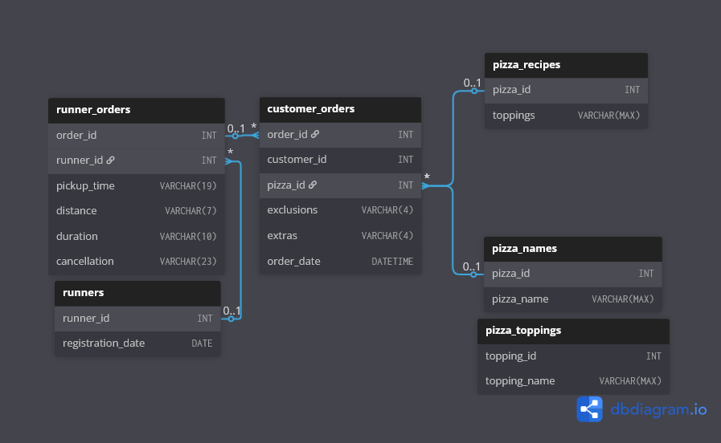

# 🍕 Case Study #2: Pizza Runner

> 🔗 **Check out the original challenge prompt and dataset here:** [Case Study #2: Pizza Runner](https://8weeksqlchallenge.com/case-study-2/)

## 📋 Table of Contents
- [The Business Problem](#-the-business-problem)
- [Tech Stack & Skills Applied](#-tech-stack--skills-applied)
- [Entity Relationship Diagram](#-entity-relationship-diagram)
- [Data Cleaning & Issues Found](#-data-cleaning--issues-found)
- [Highlight Queries & Engineering Logic](#-highlight-queries--engineering-logic)
- [What I Would Do Differently in Production](#-what-i-would-do-differently-in-production)

---

## 🏢 The Business Problem

Danny launched "Pizza Runner" — an Uber-style pizza delivery service. However, the database was filled with inconsistent data types, literal `'null'` and `'NaN'` text strings instead of actual `NULL` values, and comma-separated IDs stuffed into single columns.

**The Goal:**
Before any metrics could be calculated, the raw data required heavy cleansing and materialization into clean staging tables. Once clean, the objective was to build a T-SQL analytical layer to calculate runner efficiency, optimize ingredient costs, design a new ratings schema, and build a financial model to calculate net profit.

---

## 🛠️ Tech Stack & Skills Applied

- **Database Engine:** SQL Server (T-SQL)
- **Data Engineering Skills Applied:**
  - **Data Cleaning & Staging:** `TRY_CAST`, `REPLACE`, `TRIM`, `PATINDEX`, `SELECT INTO`
  - **String Parsing:** `CROSS APPLY STRING_SPLIT`, `STRING_AGG`, `WITHIN GROUP`
  - **Relational Data Modeling:** `CREATE TABLE`, `FOREIGN KEY`, `CHECK` constraints, `DEFAULT` timestamps
  - **Query Architecture:** CTE chaining, correlated subqueries, `UNION ALL` vertical stacking, `OUTER APPLY` lateral joins

---

## 🗄️ Entity Relationship Diagram



---

## 🧹 Data Cleaning & Issues Found

*Full cleaning script: [00_DataClean_DDL.sql](00_DataClean_DDL.sql)*

Before writing any analytical queries, I built a pre-processing script to sanitize the raw tables and materialize them into permanent staging tables using `SELECT INTO`.

| Column | Issue Found | Fix Applied |
| :--- | :--- | :--- |
| `exclusions`, `extras` | Literal `'null'`, `'NaN'`, and empty strings instead of `NULL` | `CASE WHEN TRIM(LOWER()) IN ('null','nan','')` → `NULL` |
| `distance` | Mixed formats: `'20km'`, `'20 km'`, `'20'` | `TRIM(REPLACE(LOWER(distance), 'km', ''))` |
| `duration` | Mixed formats: `'32 minutes'`, `'32mins'`, `'32'` | `PATINDEX('%m%', duration)` to slice left of first `'m'` |
| `pickup_time` | Stored as `VARCHAR` | `CAST(pickup_time AS DATETIME)` |
| `distance` | Stored as `VARCHAR` | `CAST(distance AS DECIMAL(5,1))` |
| `order_id` | No `PRIMARY KEY` defined on staging table | `ALTER COLUMN NOT NULL` → `ADD CONSTRAINT PRIMARY KEY` |

---

## 💡 Highlight Queries & Engineering Logic

### Highlight 1 — Inline Aggregation via CROSS APPLY
**Question:** *Section D, Q02 — What if there was an additional $1 charge for any pizza extras?*
*Full script: [04_D_Pricing_and_Ratings.sql](04_D_Pricing_and_Ratings.sql)*

> **Context:** Q01 established the base revenue calculation — `$12` per Meat Lovers and `$10` per Vegetarian for delivered orders only. Q02 extends this by adding a `$1` charge per extra topping.

**The Problem:** Extras are stored as a comma-separated string in a single column — `'1,4'` means two extras. A standard aggregation can't count them directly. The extras need to be split and counted per pizza row, then added to the base price in the same query without breaking the grain.

**The Solution:**
```sql
SELECT
    SUM(CASE
            WHEN c.pizza_id = 1 THEN 12
            ELSE 10
        END) + SUM(total_extra * 1)
        AS total_rev
FROM customer_orders_clean AS c
INNER JOIN runner_orders_clean AS r
    ON c.order_id = r.order_id
CROSS APPLY (
    SELECT
        COUNT(value) AS total_extra
    FROM STRING_SPLIT(c.extras, ',')
) AS splited
WHERE r.cancellation IS NULL;
```
#### 📊 Result Set
| total\_rev |
| :--- |
| 142 |

---

### Highlight 2 — Set Theory: UNION ALL + Correlated Subquery for 2x Ingredient Logic
**Question:** *Section C, Q05 — Generate an alphabetically ordered comma-separated ingredient list for each pizza order and add a `2x` in front of any relevant ingredients.*
*Full script: [03_C_Ingredient_Optimisation.sql](03_C_Ingredient_Optimisation.sql)*

**The Problem:** For each pizza order, the final ingredient list required three operations simultaneously: remove exclusions from the base recipe, add extras, and prefix any ingredient appearing in both base and extras with `2x`. This was the most complex query in the entire case study.

**The Solution:** Instead of a deeply nested CASE WHEN chain, I decomposed the problem into 7 CTEs using set theory. Base ingredients and extras were stacked vertically with `UNION ALL` — preserving duplicates intentionally. A `COUNT = 2` detects the overlap for `2x` logic. Exclusions were filtered using a correlated `NOT IN` subquery with a `NULL` guard to prevent silent data loss.

<details>
<summary><b>Click to expand full query</b></summary>

```sql
-- Assigns a unique identifier for each pizza order to handle multi-pizza per order
WITH surg_key AS (
    SELECT
        ROW_NUMBER() OVER (ORDER BY order_id) AS rownum,
        c.order_id,
        c.customer_id,
        c.pizza_id,
        n.pizza_name,
        c.exclusions,
        c.extras,
        order_time
    FROM customer_orders_clean AS c
    INNER JOIN pizza_names AS n
        ON c.pizza_id = n.pizza_id
),
-- Splits the base recipe ingredients and explodes them vertically
    recipe_ing AS (
        SELECT
            pizza_id,
            t.topping_name
        FROM pizza_recipes
        CROSS APPLY STRING_SPLIT(toppings, ',')
        INNER JOIN pizza_toppings AS t
            ON t.topping_id = TRY_CAST(TRIM(value) AS INT)
    ),
-- Splits the extras from each unique pizza and explodes them vertically
    extras_cte AS (
        SELECT
            rownum,
            t2.topping_name AS extra_ing
        FROM surg_key
        OUTER APPLY STRING_SPLIT(extras, ',') AS extra
        LEFT JOIN pizza_toppings AS t2
            ON t2.topping_id = TRY_CAST(TRIM(extra.value) AS INT)
    ),
-- Splits the exclusions from each unique pizza and explodes them vertically
    exclude_cte AS (
        SELECT
            rownum,
            t.topping_name AS excluded_ing
        FROM surg_key
        OUTER APPLY STRING_SPLIT(exclusions, ',') AS exclusion_split
        LEFT JOIN pizza_toppings AS t
            ON t.topping_id = TRY_CAST(TRIM(exclusion_split.value) AS INT)
    ),
-- Combines base ingredients with extras and filters out exclusions
    final_atomic_data AS (
        SELECT
            surg_key.rownum,
            ri.topping_name AS atomic_topping_name
        FROM surg_key
        INNER JOIN recipe_ing AS ri
            ON ri.pizza_id = surg_key.pizza_id
        WHERE ri.topping_name NOT IN (
            SELECT excluded_ing
            FROM exclude_cte
            WHERE surg_key.rownum = exclude_cte.rownum
              AND excluded_ing IS NOT NULL  -- NULL guard prevents silent data loss
        )
        UNION ALL
        SELECT rownum, extra_ing
        FROM extras_cte
    ),
-- Counts each ingredient and prefixes with 2x when it appears in both base and extras
    counted_extras AS (
        SELECT
            rownum,
            CASE
                WHEN COUNT(atomic_topping_name) = 2
                    THEN CONCAT('2x', atomic_topping_name)
                ELSE atomic_topping_name
            END AS receipt_final
        FROM final_atomic_data
        WHERE atomic_topping_name IS NOT NULL
        GROUP BY rownum, atomic_topping_name
    ),
-- Aggregates ingredients into a single alphabetically ordered comma-separated string per pizza
    s_aggregated AS (
        SELECT
            rownum,
            STRING_AGG(receipt_final, ', ')
                WITHIN GROUP (ORDER BY receipt_final ASC) AS atomic_receipt
        FROM counted_extras
        GROUP BY rownum
    )
SELECT
    s.rownum,
    order_id,
    customer_id,
    CONCAT(pizza_name, ': ', atomic_receipt) AS instruction_list,
    order_time
FROM surg_key AS s
INNER JOIN s_aggregated AS a
    ON a.rownum = s.rownum;
```

</details>

#### 📊 Result Set *(sample)*

| rownum | order\_id | customer\_id | instruction\_list | order\_time |
| :--- | :--- | :--- | :--- | :--- |
| 1 | 1 | 101 | Meatlovers: Bacon, BBQ Sauce, Beef, Cheese, Chicken, Mushrooms, Pepperoni, Salami | 2021-01-01 18:05:02.000 |
| 4 | 3 | 102 | Vegetarian: Cheese, Mushrooms, Onions, Peppers, Tomato Sauce, Tomatoes | 2021-01-02 23:51:23.000 |
| 5 | 4 | 103 | Meatlovers: Bacon, BBQ Sauce, Beef, Chicken, Mushrooms, Pepperoni, Salami | 2021-01-04 13:23:46.000 |
| 7 | 4 | 103 | Vegetarian: Mushrooms, Onions, Peppers, Tomato Sauce, Tomatoes | 2021-01-04 13:23:46.000 |
| 8 | 5 | 104 | Meatlovers: 2xBacon, BBQ Sauce, Beef, Cheese, Chicken, Mushrooms, Pepperoni, Salami | 2021-01-08 21:00:29.000 |
| 14 | 10 | 104 | Meatlovers: 2xBacon, 2xCheese, Beef, Chicken, Pepperoni, Salami | 2021-01-11 18:34:49.000 |


---

### Highlight 3 — Schema Design: Ratings Table with Referential Integrity
**Question:** *Section D, Q03 — Design a ratings table and populate it with data for each successful delivery.*
*Full script: [04_D_Pricing_and_Ratings.sql](04_D_Pricing_and_Ratings.sql)*

**The Problem:** No ratings system existed in the schema. A new table needed to be designed from scratch with proper constraints to maintain data integrity.

**Key Decisions:**
- `order_id` was chosen as the natural primary key — one order receives one rating, making a surrogate key unnecessary
- `order_id` is also a foreign key referencing `runner_orders_clean` — ensuring ratings can only exist for real delivered orders
- No FK was placed on `customer_id` — `customer_orders_clean` has no unique key on `customer_id` since one customer places many orders and no dedicated customers dimension table exists in this schema
- A `CHECK` constraint enforces valid rating values at the database level
```sql
CREATE TABLE ratings (
    order_id    INT      NOT NULL,
    runner_id   INT      NOT NULL,
    customer_id INT      NOT NULL,
    rating      INT,
    rating_time DATETIME DEFAULT GETDATE(),
    CONSTRAINT pk_ratings                     PRIMARY KEY (order_id),
    CONSTRAINT fk_ratings_runner_orders_clean FOREIGN KEY (order_id)  REFERENCES runner_orders_clean(order_id),
    CONSTRAINT fk_ratings_runners             FOREIGN KEY (runner_id) REFERENCES runners(runner_id),
    CONSTRAINT chk_ratings_rating             CHECK (rating BETWEEN 1 AND 5)
)
```

*Sample data for all 8 successful deliveries is inserted in the full script.*

---

## ⚙️ What I Would Do Differently in Production

- Cleaning logic would run as a scheduled stored procedure triggered on new data arrival — not a one-time manual script
- `SELECT INTO` was used for development simplicity — in production, staging tables would be pre-defined with `CREATE TABLE` first, with explicit data types, constraints, and indexes enforced from the start rather than retrofitted with `ALTER TABLE`
- The `ratings` table would include a `customer_id` FK once a proper customers dimension table exists in the schema

---

[👉 Click here to view the complete SQL scripts for all 4 sections](.)